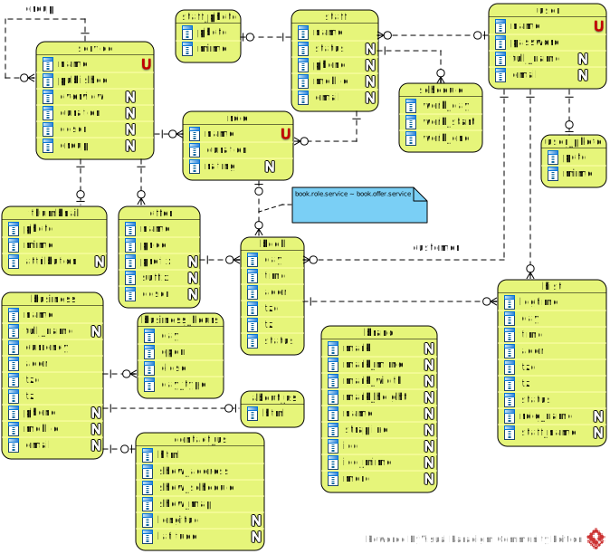
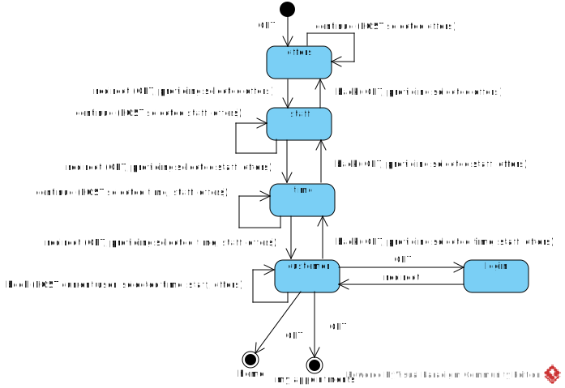
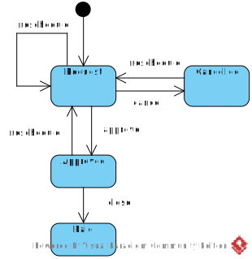

[In english](https://github.com/ciukstar/salon/blob/master/README.md)  

[În română](https://github.com/ciukstar/salon/blob/master/README.ro.md)  

[На русском](https://github.com/ciukstar/salon/blob/master/README.ru.md)

# Salon

L'application [« Salon »](https://salonfr-w3cpovaqka-de.a.run.app) offre la possibilité de publier et d'annoncer les services des propriétaires de salons de beauté sur le Web.

## Aperçu

Les services à annoncer sont définis et publiés dans la section [« Services »](https://salonfr-w3cpovaqka-de.a.run.app/admin/services) du groupe « Données ». Si nécessaire, les services peuvent être définis comme une hiérarchie de groupes et de sous-services.

Chaque service peut avoir plusieurs offres avec des prix et des devises correspondants. Les offres sont définies pour chaque Service dans la rubrique « Services » du groupe « Données ».

Une fois le service et ses offres définis, le service peut être publié. La prestation et les offres seront présentées au client dans la rubrique [« Services »](https://salonfr-w3cpovaqka-de.a.run.app/services) et disponibles à la réservation dans la rubrique [« Prenez rendez-vous »](https://salonfr-w3cpovaqka-de.a.run.app/book).

## Diagramme ERD

## Schéma de transition d'état pour la réservation

## Diagramme de transition d'état de rendez-vous

## Démo

[Cliquez ici pour voir la démo](https://salonfr-w3cpovaqka-de.a.run.app)
