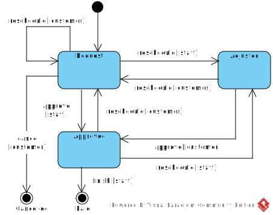

[En français](https://github.com/ciukstar/salon/blob/master/README.fr.md)  

[În română](https://github.com/ciukstar/salon/blob/master/README.ro.md)  

[На русском](https://github.com/ciukstar/salon/blob/master/README.ru.md)

# Salon

The application ["Salon"](https://salon-w3cpovaqka-de.a.run.app) provides the ability to publish and advertise the services of beauty salon owners on the web.

## Overview

The services to be advertised are defined and published in section ["Services"](https://salon-w3cpovaqka-de.a.run.app/admin/services) of group "Data". Optionally, services can be defined as a hierarchy of groups and subservices.

Each service can have multiple offers with corresponding prices and currencies. Offers are defined for each Service in the “Services” section in the “Data” group.

Once the service and its offerings are defined, the service can be published. The service and offers will be displayed to the customer in the section ["Services"](https://salon-w3cpovaqka-de.a.run.app/services) and available for booking in the section ["Book appointment"](https://salon-w3cpovaqka-de.a.run.app/book).

# Basic Entities

## Business

Detailed information about the business can be provided in the section ["Business"](https://salon-w3cpovaqka-de.a.run.app/admin/business) of the group "Data" in the main menu.

Additionally, in the section ["Business"](https://salon-w3cpovaqka-de.a.run.app/admin/business), the organization's work schedule for each day can be added.

Currently, the app only supports one business. Multi-business support is planned for future versions of the application.

## User

Application users, including clients, employees and administrators, can be registered through the ["Registration"](https://salon-w3cpovaqka-de.a.run.app/account) form.

Users can also be managed by administrators in the section [“Users”](https://salon-w3cpovaqka-de.a.run.app/admin/users) of the group “Data”.

## ERD Diagram

## State transition diagram for booking

## State transition diagram for appointment

## Demo

[Click here to see demo](https://salon-w3cpovaqka-de.a.run.app)
