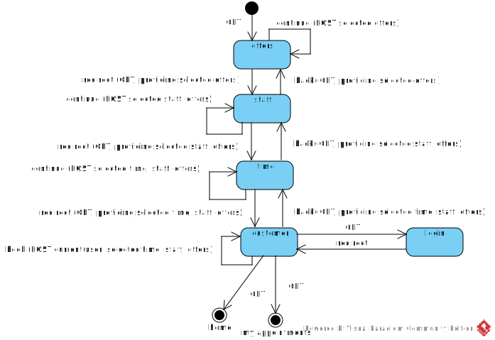

[In english](https://github.com/ciukstar/salon/blob/master/README.md)  

[En français](https://github.com/ciukstar/salon/blob/master/README.fr.md)  

[На русском](https://github.com/ciukstar/salon/blob/master/README.ru.md)

# Salon

Aplicația [„Salon”](https://salonro-w3cpovaqka-de.a.run.app) oferă posibilitatea de a publica și de a face publicitate serviciilor proprietarilor de saloane de înfrumusețare pe web.

## Prezentare generală

Serviciile care vor fi promovate sunt definite și publicate în secțiunea [„Servicii”](https://salonro-w3cpovaqka-de.a.run.app/admin/services) din grupul „Date”. Dacă este necesar, serviciile pot fi definite ca o ierarhie de grupuri și subservicii.

Fiecare serviciu poate avea mai multe oferte cu prețul corespunzător. Ofertele sunt definite pentru fiecare serviciu în secțiunea „Servicii” din grupul „Date”.

Odată ce serviciul și ofertele sale sunt definite, serviciul poate fi publicat. Serviciul și ofertele vor fi afișate clientului în secțiunea [„Servicii”](https://salonro-w3cpovaqka-de.a.run.app/services) și disponibile pentru rezervare în secțiunea [„Rezervă o programare”](https://salonro-w3cpovaqka-de.a.run.app/book).

# Entităţile de bază

## Afacere

Informații detaliate despre afacere pot fi furnizate în secțiunea [„Afacere”](https://salonro-w3cpovaqka-de.a.run.app/admin/business) din grupul „Date” din meniul principal.

În plus, din fila [„Program”](https://salonro-w3cpovaqka-de.a.run.app/admin/business/1/hours) în secțiunea [„Afacere”](https://salonro-w3cpovaqka-de.a.run.app/admin/business), poate fi adăugat programul de lucru al organizației pentru fiecare zi.

Pagina „Despre noi” poate fi personalizată din fila [„Despre noi”](https://salonro-w3cpovaqka-de.a.run.app/admin/about/business/1) din meniul [„Afacere”](https://salonro-w3cpovaqka-de.a.run.app/admin/business) din grupul „Date”.

Pagina „Contacte” poate fi personalizată din fila [„Contactați-ne”](https://salonro-w3cpovaqka-de.a.run.app/admin/contact/business/1) din meniul [„Afacere”](https://salonro-w3cpovaqka-de.a.run.app/admin/business) din grupul „Date”.

Pagina [„Acasă”](https://salon-w3cpovaqka-de.a.run.app) este personalizabilă din fila [„Marca”](https://salon-w3cpovaqka-de.a.run.app/admin/business/1/brand) din meniul [„Afacere”](https://salon-w3cpovaqka-de.a.run.app/admin/business) din grupul „Date”.

În prezent, aplicația acceptă o singură afacere. Asistența multi-business este planificată pentru versiunile viitoare ale aplicației.

## Utilizator

Utilizatorii aplicației, inclusiv clienți, angajați și administratori, pot fi înregistrați prin intermediul formularului [„Înregistrare”](https://salonro-w3cpovaqka-de.a.run.app/account).

De asemenea, utilizatorii pot fi gestionați de administratori în secțiunea [„Utilizatori”](https://salonro-w3cpovaqka-de.a.run.app/admin/users) din grupul „Date”.

Un utilizator înregistrat poate avea mai multe roluri în același timp.

Un administrator poate atribui rolul „Administrator” oricărui alt utilizator înregistrat. Rolul de „Administrator” este necesar pentru a avea acces la orice secțiune a grupului „Date”. Adică pentru a gestiona configurația și datele aplicației.

Un administrator poate atribui rolul „Analist” oricărui alt utilizator înregistrat. Rolul „Analist” este necesar pentru a avea acces la orice secțiune a grupului „Analiza”. Adică pentru a genera rapoarte analitice.

Orice utilizator care este înregistrat și ca membru al personalului are rolul „Angajat”. Un utilizator cu rolul „Angajat” are acces la coada de solicitări de servicii.

Toți utilizatorii pot deveni clienți prin simpla înregistrare și utilizarea serviciilor oferite.

## Diagrama ERD

## Diagrama de tranziție a stării pentru rezervare

## Diagrama tranziție de stare a programării

## Demo

[Click aici pentru a vedea demo](https://salonro-w3cpovaqka-de.a.run.app)
