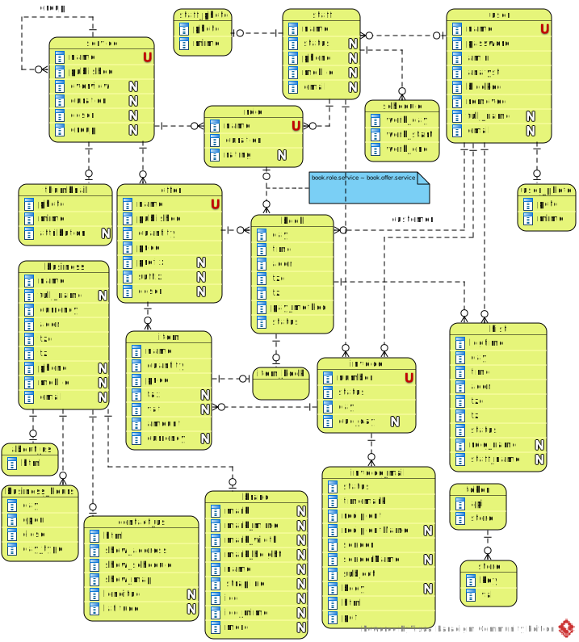

[In english](https://github.com/ciukstar/salon/blob/master/README.md)  

[En français](https://github.com/ciukstar/salon/blob/master/README.fr.md)  

[În română](https://github.com/ciukstar/salon/blob/master/README.ro.md)

# Салон

Приложение [«Салон»](https://salonru-w3cpovaqka-de.a.run.app) предоставляет возможность публиковать и рекламировать услуги владельцев салонов красоты в сети.

## Обзор

Рекламируемые услуги определены и опубликованы в разделе [«Услуги»](https://salonru-w3cpovaqka-de.a.run.app/admin/services) группы «Данные». При желании услуги можно определить как иерархию групп и подуслуг.

Каждая услуга может иметь несколько предложений с соответствующими ценами и валютами. Предложения определены для каждой Услуги в разделе «Услуги» в группе «Данные».

После определения службы и ее предложений ее можно опубликовать. Услуга и предложения будут отображены клиенту в разделе [«Услуги»](https://salonru-w3cpovaqka-de.a.run.app/services) и доступны для бронирования в разделе [«Записаться на приём»](https://salonru-w3cpovaqka-de.a.run.app/book).

# Основные сущности

## Организация

Подробную информацию об организации можно предоставить в разделе [«Организация»](https://salonru-w3cpovaqka-de.a.run.app/admin/business) группы «Данные» главного меню.

Дополнительно в разделе [«Организация»](https://salonru-w3cpovaqka-de.a.run.app/admin/business) на вкладке [«График»](https://salonru-w3cpovaqka-de.a.run.app/admin/business/1/hours) можно добавить график работы организации на каждый день.

Страницу «О нас» можно настроить на вкладке [«О нас»](https://salonru-w3cpovaqka-de.a.run.app/admin/about/business/1) в меню [«Бизнес»](https://salonru-w3cpovaqka-de.a.run.app/admin/business) в группе «Данные».

Страницу «Контакты» можно настроить на вкладке [«Контакты»](https://salonru-w3cpovaqka-de.a.run.app/admin/contact/business/1) в меню [«Бизнес»](https://salonru-w3cpovaqka-de.a.run.app/admin/business) в группе «Данные».

В настоящее время приложение поддерживает только один бизнес. Поддержка нескольких организаций планируется в будущих версиях приложения.

## Пользователь

Пользователи приложения, включая клиентов, сотрудников и администраторов, могут быть зарегистрированы через форму [«Регистрация»](https://salonru-w3cpovaqka-de.a.run.app/account).

Также управлять пользователями администраторы могут в разделе [«Пользователи»](https://salonru-w3cpovaqka-de.a.run.app/admin/users) группы «Данные».

## ER-диаграмма

## Диаграмма перехода состояний для бронирования

## Схема перехода состояний для записи на приём

## Демо

[Нажмите здесь, чтобы увидеть демо](https://salonru-w3cpovaqka-de.a.run.app)
